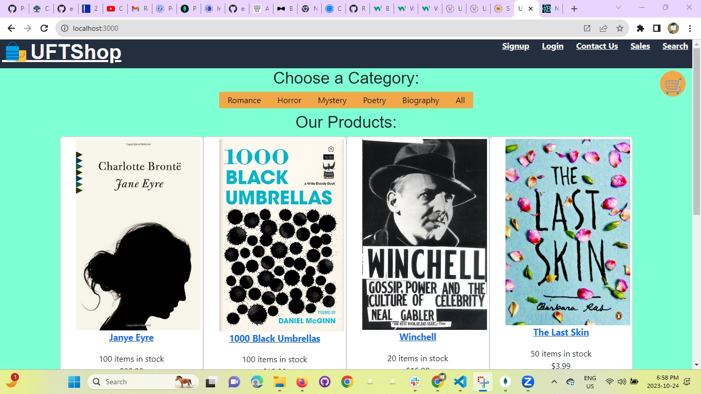
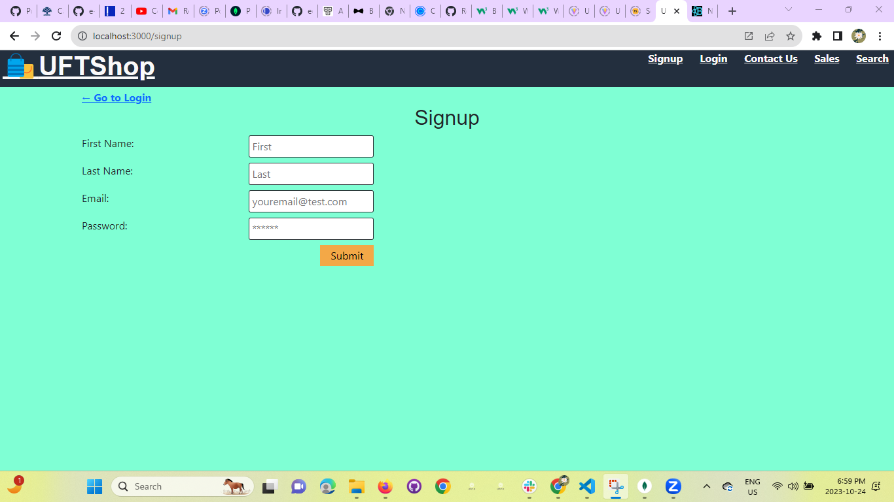
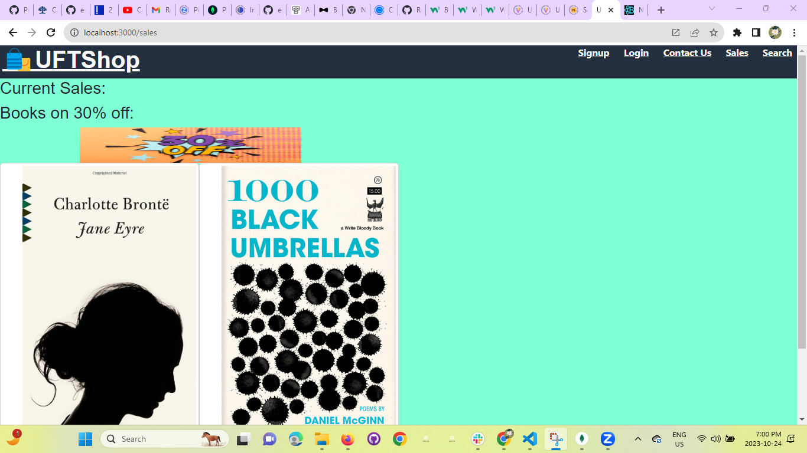
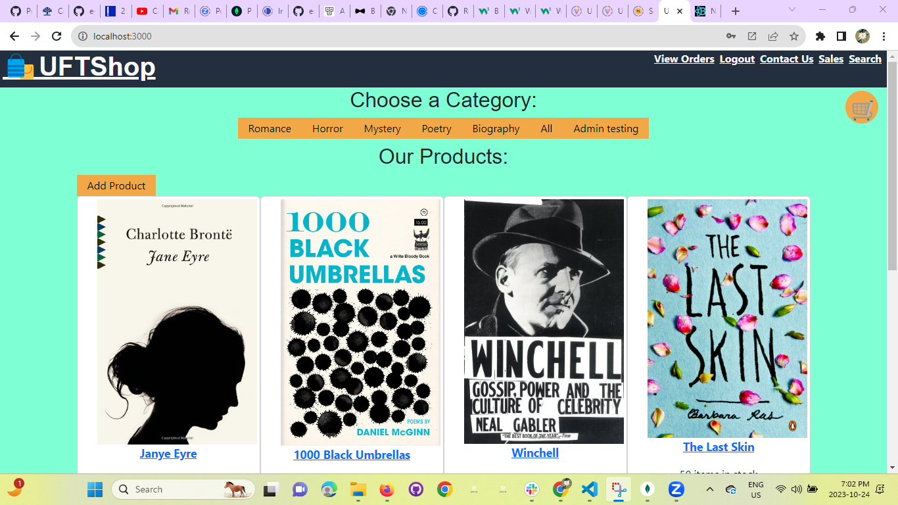

## E-Commerce- Application ##

<a href='https://e-store-e55ee7daa6ad.herokuapp.com/'>Deployment</a>

## About:
This is an E-Commerce website built for selling books online.
A user can visit the website, register and login. They can see all the available products, on a separate page they can filter and search for items based on a category or price range and sort in ascending or descending by price or date added. Products can be added or removed from a cart. The user can then proceed to checkout and click the credit card payment details to proceed. Once the payment is success the orders will be placed and users will be able to see the orders details in the orders section.

Note: Currently the checkout is not working. Clicking on checkout from the cart does not redirect as it should.

## Technologies Used:
- MERN
- Bootstrap
- Apollo
- Json Web Token
- Stripe

## Login Credientals for Testing
Basic User

- Username: jsmith@fake.com
- Password: password12345

Admin

- Username: admin@gmail.com
- Password: adminpassword

Stripe Test Card

- Number: 4242424242424242
- CVC: any 3 digits
- Date: Any future date

## Source & Contributors

This was cloned from a repo I made during the University of Toronto boot camp as part of a team. It was cloned so I can modify it by myself without affecting the original code.

<a href='https://github.com/phvania/E-Commerce-'>Original Repo</a>

## Screenshots:

